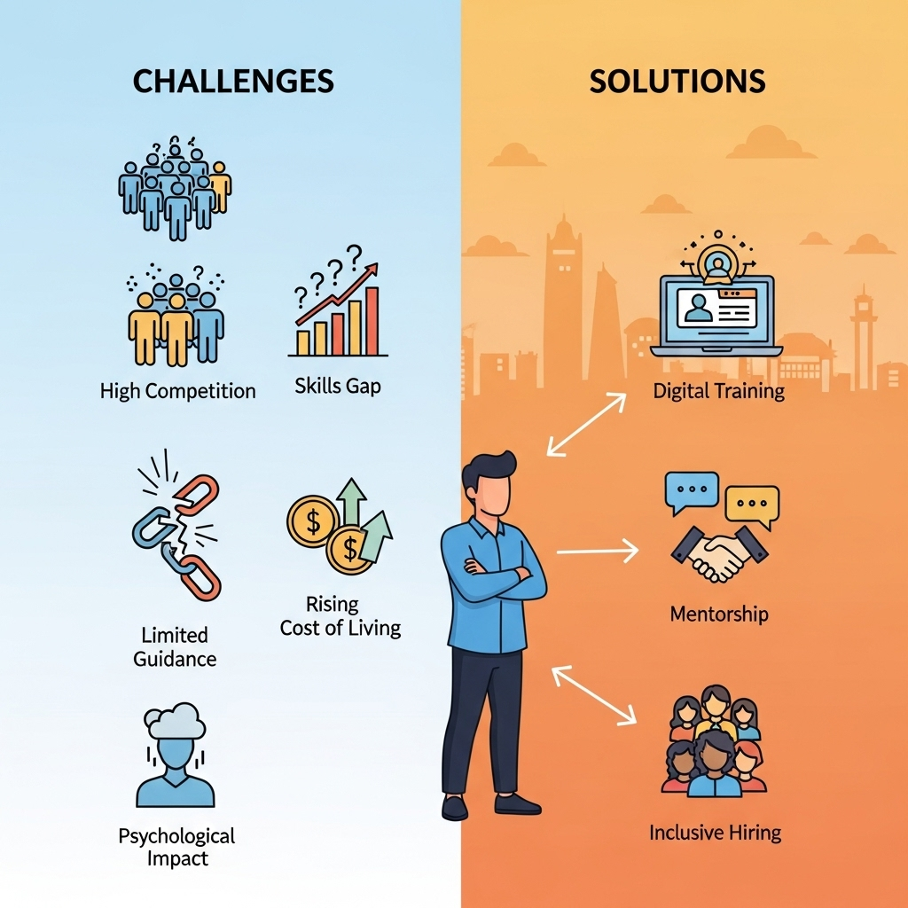

# Linkedin-post-generator-n8n

This project automates the creation and delivery of tailored LinkedIn posts based on user-provided topics and target audiences. It utilizes [n8n](https://n8n.io/) for workflow orchestration, [OpenAI](https://platform.openai.com/) for content generation, and [Tavily](https://www.tavily.com/) for contextual web search.

## Features

- Takes 3 inputs: `Post Topic`, `Target Audience`, and `Recipient Email`
- Uses OpenAI to generate engaging LinkedIn-style content
- Enhances factuality with Tavily search context
- Automatically sends the post to the user via email
- Can be self-hosted or deployed via n8n Cloud

## Sample Output

**Post content:**
Job Searching in Pune: The Real Struggle for Youth from Rural and Tier 3 Cities

For many young people from rural areas and tier 3 cities, moving to Pune in search of better job opportunities is both exciting and daunting. However, the path is laden with challenges that often go unspoken:

🔹 High Competition: Pune attracts graduates and skilled professionals from across Maharashtra and beyond. Standing out in this crowded market is difficult without strong networks or urban exposure.

🔹 Skill Gaps: Many candidates from smaller towns face gaps in technical skills or soft skills tailored to Pune’s industries like IT, manufacturing, and services.

🔹 Cost of Living: Unlike their hometowns, Pune’s cost of living is substantially higher, posing financial pressure during long job searches or unpaid internships.

🔹 Limited Access to Guidance: Lack of mentorship, career counseling, and awareness about industry expectations makes it tougher to prepare for interviews or build a professional profile.

🔹 Psychological Impact: Repeated rejections and adjustment to city life can cause frustration, self-doubt, and sometimes disillusionment.

Addressing these challenges requires a multi-pronged approach: enhancing digital and vocational training access in rural areas, establishing support networks in Pune for newcomers, and promoting inclusive hiring practices by companies.

If you are a youth facing these struggles or a professional who has navigated them, your insights can inspire solutions and hope. How have you overcome job search challenges in Pune? What support systems have helped you or your community?

Let’s connect, share, and create opportunities for every aspiring talent in our cities and villages.

#JobSearch #PuneJobs #RuralYouth #CareerGrowth #EmploymentChallenges #SkillDevelopment #InclusiveHiring #YouthEmpowerment

(Source: Insights based on recent labor market trends and community feedback)




## Workflow Details

- **n8n nodes used**: HTTP Request, OpenAI, Tavily, Email
- **Input**: Topic, Audience, Email (entered via manual trigger or webhook)
- **Output**: Email containing a formatted LinkedIn post
- **Security**: No data is logged; credentials managed via n8n secrets

## Getting Started

1. Import `workflow/Linkedin_Post_Workflow.json` into your n8n instance.
2. Set your API credentials for:
   - OpenAI
   - Tavily
   - Email provider (e.g., Gmail, SMTP)
3. Trigger the workflow manually or via webhook.
4. Check your inbox for the generated post.

## Repository Structure

```
Linkedin-post-generator-n8n
├── workflow/               # Contains exported n8n workflow JSON
├── assets/                 # Screenshots or output samples
├── .gitignore              # General ignores
└── README.md               # Project documentation
```

## Technologies Used

- n8n (workflow automation)
- OpenAI (text generation)
- Tavily API (web search context)
- NodeMailer (email dispatch)
- Markdown, HTML formatting

## License
```
This project is licensed under the MIT License.
```


